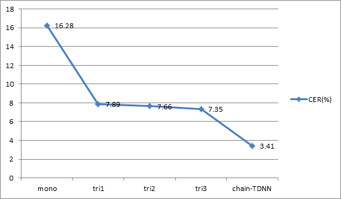

# 最大规模开源中文语料库 — aidatatang_1505zh及其语音识别基准实验详解

## 说在前面

AI正切实影响着社会生产生活的各个方面，目前人工智能产品正在走向实用化、多样化，人工智能应用也正在快速拓展助力传统行业转型升级。算法、算力、数据是驱动人工智能产业快速崛起的三大因素，其中，数据是人工智能的基石，只有拥有大量的数据资源，人工智能才会有更好的发展。

作为人工智能数据服务行业的领军企业，数据堂多年来秉承着“用数据支撑AI，以智能改变世界”的企业愿景。因此，为解决在各应用领域数据匮乏的现状，帮助更多的研究人员拓宽研究领域，丰富研究内容，加速迭代，**数据堂推出AI数据开源计划，**面向高校和学术机构等非商业组织群体，首次开源的数据集为：**1505小时中文普通话语音数据集（即：[aidatatang_1505zh](<https://www.datatang.com/webfront/opensource.html>)）**。该数据集是目前业内数据量最大、句准确率最高的中文普通话开源数据集。

## 最全的开源中文语料库

深度学习的引入极大地促进了语音识别技术的发展，同时也促使数据成为更好地训练声学模型的关键。大多数中文语音数据集是商用的，获取它们需要支付昂贵的费用。对一些企业来说，为了训练更好的声学模型完全可以任意购买这些数据集，然而，对于坐在实验室的学生们而言，这些数据集往往可望而不可即。为了测试新的想法，他们大多采用自己录制的小规模数据集，这样不均衡的数据集对语音识别训练的效果具有非常明显的影响，导致算法无法得到有效验证。而“数据开源”活动有效地缓解了这一问题，同时也吸引了越来越多的人投入到语音识别研究领域中。从2015年清华大学首次公开了包含30多小时音频的thchs30数据集开始，陆续有不同规模的中文语音数据集参与到数据开源活动中，下表汇总了目前所有的开源中文语音语料库及其详情。

| 数据集                | 时长（小时） | 录制人   | 标注准确率 | 数据下载                                                    |
| --------------------- | ------------ | -------- | ---------- | ----------------------------------------------------------- |
| thchs30               | 33.47        | 40       | -          | [下载](<http://www.openslr.org/18/>)                        |
| Primewords_set1       | 100          | 296      | 98%        | [下载](<http://www.openslr.org/47/>)                        |
| aishell1              | 178          | 400      | 95%        | [下载](<http://www.openslr.org/33/>)                        |
| ST-CMDS               | 500          | 855      | -          | [下载](http://www.openslr.org/38/)                          |
| aishell2              | 1000         | 1991     | 96%        | [下载](<http://www.aishelltech.com/aishell_2>)              |
| **aidatatang_200zh**  | **200**      | **600**  | **>98%**   | [下载](<http://www.openslr.org/62/>)                        |
| **aidatatang_1505zh** | **1505**     | **6408** | **>98%**   | [下载](<https://www.datatang.com/webfront/opensource.html>) |

从上表可以看出，**aidatatang_1505zh**数据集的有效时长达**1505**小时，由**6408**名来自中国不同地区的录音人参与录制，是目前规模最大的开源中文语音语料库。经过专业语音校对及转写标注，通过严格质量检验，此数据集的句标注准确率达**98%**以上，是行业内句准确率的最高标准。更多详情请访问[数据堂AI开源计划](<https://www.datatang.com/webfront/opensource.html>)。

## 最详细的语音识别实验讲解

除了发布aidatatang_1505zh数据集之外，数据堂也基于该数据集展开了相应的语音识别基准实验，本节将会详细介绍实验的过程。

### Kaldi安装

该实验依托于Kaldi语音识别工具箱，因此首先需要在环境中安装Kaldi。

详情请参考[基于Kaldi的aidatatang_200zh的训练之葵花宝典](<https://github.com/datatang-ailab/aidatatang_200zh/blob/master/README.zh.md>)。

### 一键运行

**数据准备：**

1. 数据集下载：请访问[数据堂官网](https://www.datatang.com/webfront/opensource.html)申请免费获取aidatatang_1505zh中文语音数据集；
2. 将数据集划分成训练集、验证集、测试集，并在每个子集内准备相应wav.scp及trans.txt文件；

**程序下载：**

请访问数据堂GitHub账户获取相关资源，将aidatatang_1505zh语音识别实验相关程序下载到本地：

```shell
cd kaldi/egs
git clone git@github.com:datatang-ailab/aidatatang_1505zh.git
```

**一键识别：**

在数据准备阶段，本实验采用了结巴分词工具对标注文本进行分词，因而，须首先在环境中安装jieba工具包，见如下命令：

```shell
cd kaldi/tools/extras
./install_jieba.sh
```

当数据及程序均已准备完成后，即可开启一键式语音识别实验了！

```shell
cd kaldi/egs/aidatatang_1505zh
vim run.sh ### 记得将以下地址修改成本地数据集的路径
## trn_set=/export/a05/xna/data/train
## dev_set=/export/a05/xna/data/dev
## tst_set=/export/a05/xna/data/test
./run.sh
```

如果您只想测试数据集的语音识别效果，那么您阅读到这里就可以了。

如果您想对语音识别的过程有更深入的了解，请继续阅读下面的内容。

### 实验详解

**概览：**

词典：DaCiDian

语言模型：kaldi-lm

声学模型：

- GMM-HMM模型
- Chain-TDNN-HMM模型

**代码注解：**

本实验包括三个重要阶段，如下面总脚本run.sh所示：

```shell
# prepare trn/dev/tst data, lexicon, lang etc
if [ $stage -le 1 ]; then
  local/prepare_all.sh ${trn_set} ${dev_set} ${tst_set} || exit 1;
fi

# GMM
if [ $stage -le 2 ]; then
  local/run_gmm.sh --nj $nj --stage $gmm_stage
fi

# chain
if [ $stage -le 3 ]; then
  local/chain/run_tdnn_1a.sh --nj $nj
fi
```

**1. 准备阶段：(prepare_all.sh)**

- 准备词典：

  下载用于中文语音识别的DaCiDian，并为后期编译L.fst提供所需的silence_phones.txt，nonsilence_phones.txt，optional_silence.txt，extra_questions.txt文件。

  ```shell
  local/prepare_dict.sh data/local/dict
  ```

- 准备数据：

  为数据准备Kaldi依赖的相关映射文件，包括wav.scp，spk2utt，utt2spk，text文件。

  ```shell
  local/prepare_data.sh ${trn_set} data/local/dict data/local/train data/train
  local/prepare_data.sh ${dev_set} data/local/dict data/local/dev   data/dev
  local/prepare_data.sh ${tst_set} data/local/dict data/local/test  data/test
  ```

- 准备语言模型

  根据词典和数据集的标注文本训练语言模型，包括将音素序列映射成词语序列的L.fst，三元文法语言模型G.fst，以及编译LG.fst。

  ```shell
  # L
  tils/prepare_lang.sh --position-dependent-phones false data/local/dict "<UNK>" data/local/lang data/lang
  
  # arpa LM
  local/train_lms.sh data/local/dict/lexicon.txt data/local/train/text data/local/lm 
  
  # G compilation, check LG composition
  utils/format_lm.sh data/lang data/local/lm/3gram-mincount/lm_unpruned.gz data/local/dict/lexicon.txt data/lang_test
  ```

**2. GMM-HMM模型训练阶段：(run_gmm.sh)**

实验进行GMM-HMM模型训练时，采取的是语音的MFCC+pitch特征，如下所示：

```shell
for x in train dev test; do
    steps/make_mfcc_pitch.sh --pitch-config conf/pitch.conf --cmd "$train_cmd" --nj $nj data/$x exp/make_mfcc/$x mfcc || exit 1;
    steps/compute_cmvn_stats.sh data/$x exp/make_mfcc/$x mfcc || exit 1;
    utils/fix_data_dir.sh data/$x || exit 1;
done
```

为了快速启动模型的训练，本实验从原始数据中抽取了部分数据，如下所示：

```shell
# subset the training data for fast startup
for x in 120 320; do
   utils/subset_data_dir.sh data/train ${x}000 data/train_${x}k
done
```

用12万条数据启动单音素GMM-HMM模型(mono)的训练：

```shell
steps/train_mono.sh --cmd "$train_cmd" --nj $nj \
    data/train_120k data/lang exp/mono || exit 1;
```

用训练好的mono模型对抽取的32万条数据做对齐，对这些数据进行三音素GMM-HMM模型(tri1)的快速训练：

```shell
steps/align_si.sh --cmd "$train_cmd" --nj $nj \
    data/train_320k data/lang exp/mono exp/mono_ali || exit 1;
    
steps/train_deltas.sh --cmd "$train_cmd" \
   5000 40000 data/train_320k data/lang exp/mono_ali exp/tri1 || exit 1;
```

用训练好的三音素模型对所有数据做对齐，对所有数据再次进行三音素GMM-HMM模型(tri2)的训练：

```shell
steps/align_si.sh --cmd "$train_cmd" --nj $nj \
    data/train data/lang exp/tri1 exp/tri1_ali || exit 1;
    
steps/train_deltas.sh --cmd "$train_cmd" \
   8000 64000 data/train data/lang exp/tri1_ali exp/tri2 || exit 1;
```

对特征进行线性判别分析及最大似然线性变换后再次训练三音素GMM-HMM模型(tri3)：

```shell
steps/train_lda_mllt.sh --cmd "$train_cmd" \
   11000 88000 data/train data/lang exp/tri2_ali exp/tri3 || exit 1;
```

**3. Chain-TDNN-HMM模型训练阶段：(run_tdnn_1a.sh)**

本实验在最后采用了链式模型chain model和TDNN网络搭建了DNN-HMM声学模型结构。

由于DNN-HMM模型在CPU上训练速度较慢，因此最好是在GPU上进行训练，并且确保已经编译CUDA！

在进行DNN-HMM模型训练时，本实验采取的是语音的fbank特征，如下所示：

```shell
steps/make_fbank.sh --cmd "$train_cmd" --nj 70  data/${train_set}_fbank exp/make_mfcc/train_fbank mfcc_fbank
steps/compute_cmvn_stats.sh data/${train_set}_fbank exp/make_mfcc/train_fbank mfcc_fbank
utils/fix_data_dir.sh data/${train_set}_fbank
```

进行LF-MMI训练：

```shell
steps/align_fmllr_lats.sh --nj $nj --cmd "$train_cmd" data/$train_set data/lang exp/tri5a exp/tri5a_sp_lats
```

构造优化的HMM拓扑结构：

```shell
silphonelist=$(cat $lang/phones/silence.csl) || exit 1;
nonsilphonelist=$(cat $lang/phones/nonsilence.csl) || exit 1;
# Use our special topology... note that later on may have to tune this topology.
steps/nnet3/chain/gen_topo.py $nonsilphonelist $silphonelist >$lang/topo
```

根据新的拓扑结构重新生成决策树：

```shell
steps/nnet3/chain/build_tree.sh --frame-subsampling-factor 3 \
      --context-opts "--context-width=2 --central-position=1" \
      --cmd "$train_cmd" 5000 data/${train_set} $lang $ali_dir $treedir
```

配置神经网络结构：

本实验的输入为40维特征，共有13层网络层，每层隐藏层有1280个节点，网络的输出为8984个类别。具体的网络描保存在exp/chain/tdnn_1a_sp/configs/目录下。

训练TDNN网络：

```shell
steps/nnet3/chain/train.py
```

构建解码图：

```shell
utils/mkgraph.sh --self-loop-scale 1.0 data/lang_test $dir $dir/graph
```

解码：

```shell
steps/nnet3/decode.sh --acwt 1.0 --post-decode-acwt 10.0 --nj 10 --cmd "$decode_cmd" \
      $graph_dir data/${test_set}_fbank $dir/decode_${test_set} || exit 1;
```

### 实验结果

**查看实验结果：(local/show_results.sh)**

```shell
for x in exp/*/decode_test; do [ -d $x ] && grep WER $x/cer_* | utils/best_wer.sh; done 2>/dev/null
```

下图展示了基于该aidatatang_1505zh数据集进行的GMM-HMM模型（mono、tri1、tri2、tri3）训练及Chain-TDNN-HMM模型训练后的字错误率（CER）结果。

由结果可知，DNN-HMM模型训练的效果确实比GMM-HMM模型训练的效果准确。




### 模型开源

继数据开源之后，数据堂决定将上述语音识别模型开源，以便更多研究人员对自有数据进行中文语音识别的研究。
模型下载请访问[这里](http://bj-oss-data-04.oss-cn-beijing.aliyuncs.com/%E5%BC%80%E6%BA%90%E6%95%B0%E6%8D%AE/aidatatang_1505zh_ac_model.tar.gz?OSSAccessKeyId=LTAI2gYkXSt4KRmE&Expires=1570328924&Signature=%2F0zSaPHze%2F%2FAcR4Y5H5eJz8BhQA%3D)。

## 更多数据资源

数据堂是一家专业的人工智能数据服务提供商，致力于为全球人工智能企业提供数据获取、处理及数据产品服务，覆盖语音、图像、文本等数据类型，涵盖生物识别、语音识别、自动驾驶、智能家居、智能制造、新零售、OCR场景、智能医疗、智能交通、智能安防、手机娱乐等领域。

- 获取更多开源数据集，请访问[这里](https://www.datatang.com/webfront/opensource.html)
- 了解更多商业数据集，请点击[这里](https://www.datatang.com/webfront/datatang_dataset.html)

面向高校及科研群体,数据堂将持续开源更多高质量商业数据集,帮助研究人员拓宽研究领域，丰富研究内容，加速迭代。敬请期待！
